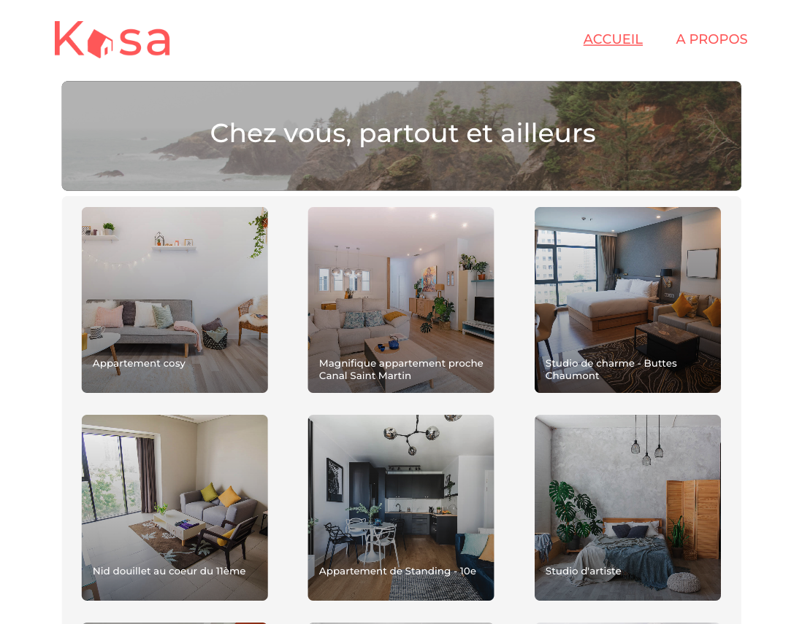

# Kasa: plateforme de location de logements entre particuliers

### Projet 11 d'Openclassrooms developpeur web front end Javascript React

---

> BESOIN

Refonte totale pour passer à une stack complète en JavaScript avec NodeJS côté Back-end, et React côté Front-end.

## Compétences développées

-   Initialiser une application web avec Create React App
-   Diviser le code en composants React
-   Développer les routes d'une application web avec React Router
-   Développer les routes d'une application web avec React Router
-   Suivre les maquettes Figma
-   Respecter les coding Guidelines

## Ressources fournies

-   [maquette UI](https://www.figma.com/file/bAnXDNqRKCRRP8mY2gcb5p/UI-Design-Kasa-FR?node-id=4%3A1)
-   [coding guidelines](https://course.oc-static.com/projects/Front-End+V2/P9+React+1/Coding+guidelines+Kasa+FR.pdf)
-   [Base de données](https://s3-eu-west-1.amazonaws.com/course.oc-static.com/projects/Front-End+V2/P9+React+1/logements.json)

### Available Scripts

-   Cloner le repo `cd kasa`
-   Lancer l'application en local `npm run start`
-   Le navigateur devrait s'ouvrir automatiquement sur [http://localhost:3000](http://localhost:3000)
